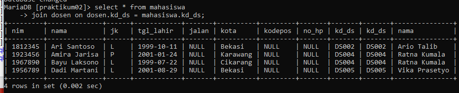
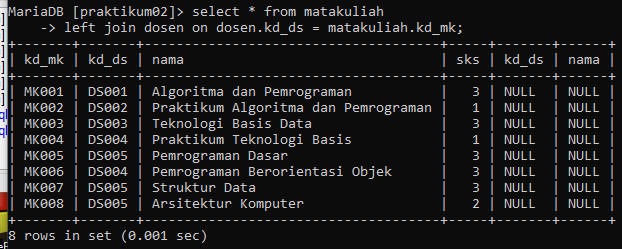
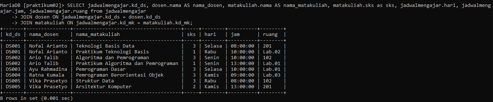
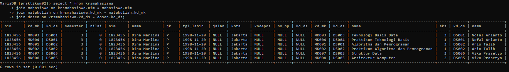
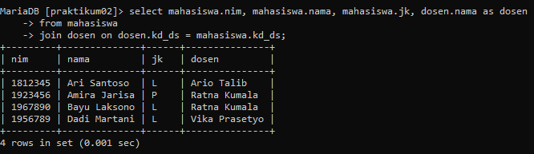
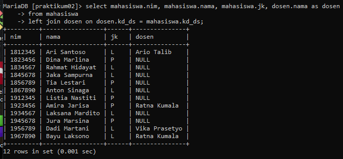
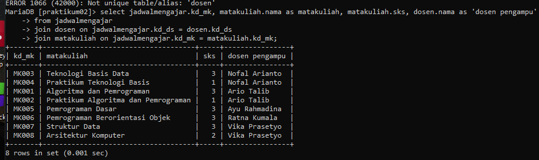
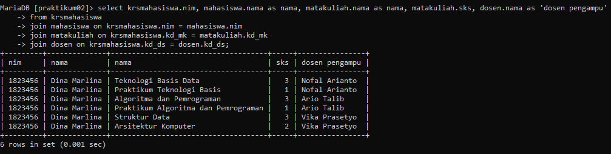

# Praktikum 5

## Latihan!

- Lakukan join table mahasiswa dan dosen

- Lakukan join table matakuliah dan dosen

- Lakukan join table jadwalmengajar, dosen dan matakuliah

- Lakukan join table krsmahasiswa, mahasiswa, matakuliah, dan dosen

## Script SQL berdasarkan perintah dibawah ini !!!

1. JOIN table mahasiswa dan dosen

`SELECT mahasiswa.nim, mahasiswa.nama, mahasiswa.jk, dosen.nama AS dosen 
-> FROM mahasiswa 
-> JOIN dosen ON dosen.kd_ds = mahasiswa.kd_ds;`

2. LEFT JOIN table mahasiswa dan dosen

`SELECT mahasiswa.nim, mahasiswa.nama, mahasiswa.jk, dosen.nama AS Dosen 
-> FROM mahasiswa
-> LEFT JOIN dosen ON dosen.kd_ds = mahasiswa.kd_ds;`

3. JOIN table jadwalmengajar, dosen dan matakuliah

`SELECT jadwalmengajar.kd_mk, matakuliah.nama as matakuliah, matakuliah.sks, dosen.nama AS 'dosen pengampu' 
-> FROM jadwalmengajar
-> JOIN dosen ON jadwalmengajar.kd_ds = dosen.kd_ds
-> JOIN matakuliah ON jadwalmengajar.kd_mk = matakuliah.kd_mk;`

`SELECT jadwalmengajar.kd_mk, dosen.nama as nama_dosen, matakuliah.nama as nama_matakuliah, matakuliah.sks, jadwalmengajar.hari, jadwalmengajar.jam, jadwalmengajar.ruang, jadwalmengajar.ruang 
-> FROM jadwalmengajar
-> JOIN dosen ON jadwalmengajar.kd_ds = dosen.kd_ds
-> JOIN matakuliah ON jadwalmengajar.kd_mk = matakuliah.kd_mk;`

4. JOIN table krsmahasiswa, mahasiswa, matakuliah dan dosen

`SELECT krsmahasiswa.nim, mahasiswa.nama AS nama, matakuliah.nama AS nama, matakuliah.sks, dosen.nama AS 'dosen pengampu' 
-> FROM krsmahasiswa
-> JOIN mahasiswa ON krsmahasiswa.nim = mahasiswa.nim
-> JOIN matakuliah ON krsmahasiswa.kd_mk = matakuliah.kd_mk
-> JOIN dosen ON krsmahasiswa.kd_ds = dosen.kd_ds;`

